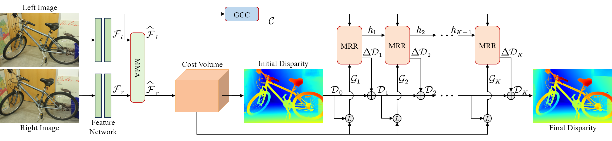

# GIO-Stereo

Official implementation of **GIO-Stereo: Generalization-Oriented Iterative Optimization for Real-Time Stereo Matching**.

GIO-Stereo is an iterative stereo matching network designed for real-time inference and zero-shot generalization.

## Network Architecture

<p align="center">
  
</p>

GIO-Stereo consists of three main components: Multi-scale Matching Attention (MMA), Global Consistency Context (GCC), and Multi-scale Recurrent Refinement (MRR).

## Environment

The current environment is configured with Python 3.8, PyTorch 2.0.1, and CUDA 11.7.

Create and activate a Conda environment:

```bash
conda create -n gio_stereo python=3.8 -y
conda activate gio_stereo
```

Install the required dependencies:

```bash
bash env_bfloat16.sh
```

## Data Preparation

Download the datasets from their official websites:

- [Scene Flow](https://lmb.informatik.uni-freiburg.de/resources/datasets/SceneFlowDatasets.en.html)
- [KITTI 2012 and KITTI 2015](https://www.cvlibs.net/datasets/kitti/)
- [Middlebury](https://vision.middlebury.edu/stereo/data/)
- [ETH3D](https://eth3d.ethz.ch/datasets)
- [TartanAir](https://tartanair.org/)
- [CREStereo Dataset](https://github.com/megvii-research/CREStereo)
- [Falling Things](https://research.nvidia.com/publication/2018-06_falling-things-synthetic-dataset-3d-object-detection-and-pose-estimation)
- [Virtual KITTI 2](https://europe.naverlabs.com/proxy-virtual-worlds-vkitti-2/)
- [InStereo2K](https://github.com/YuhuaXu/StereoDataset)

After downloading the datasets, configure their local root paths in `core_rt/stereo_datasets.py`.

## Evaluation

Pretrained models can be downloaded from [Google Drive](https://drive.google.com/drive/folders/1rao5WSe9tqe_mE65MbvatpiQ4BAjoD8R?usp=drive_link). After downloading the checkpoints, place them in the `checkpoints/` directory:

```text
checkpoints/
├── sceneflow.pth
├── zero_shot.pth
├── kitti2012.pth
├── kitti2015.pth
├── middlebury.pth
└── eth3d.pth
```

For example, evaluate the Scene Flow checkpoint using:

```bash
python evaluate_stereo_rt.py
```

The evaluation script supports Scene Flow, KITTI 2012, KITTI 2015, Middlebury, and ETH3D.

## Training

Train GIO-Stereo on Scene Flow:

```bash
CUDA_VISIBLE_DEVICES=0,1 accelerate launch train_sceneflow.py
```

Train the mixed-dataset model for zero-shot generalization:

```bash
CUDA_VISIBLE_DEVICES=0,1 accelerate launch train_zero_shot.py
```

Train the dataset-specific models:

```bash
CUDA_VISIBLE_DEVICES=0,1 accelerate launch train_kitti.py
CUDA_VISIBLE_DEVICES=0,1 accelerate launch train_middlebury.py
CUDA_VISIBLE_DEVICES=0,1 accelerate launch train_eth3d.py
```

The corresponding training configurations are provided in the `config/` directory.

## Acknowledgements

Special thanks to RT-IGEV for providing the code base for this work.

<details>
<summary>
<a href="https://github.com/gangweix/IGEV-plusplus">RT-IGEV</a> 
</summary>
